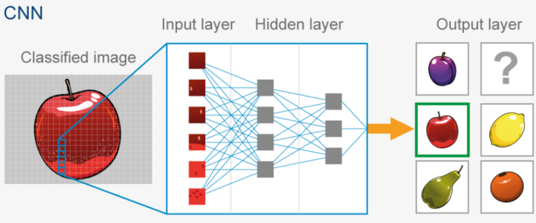
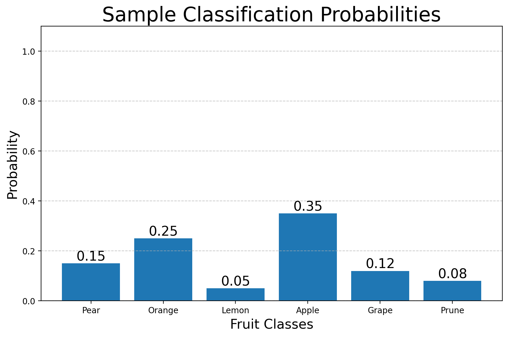
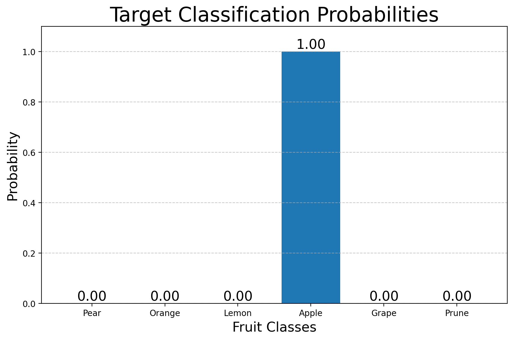
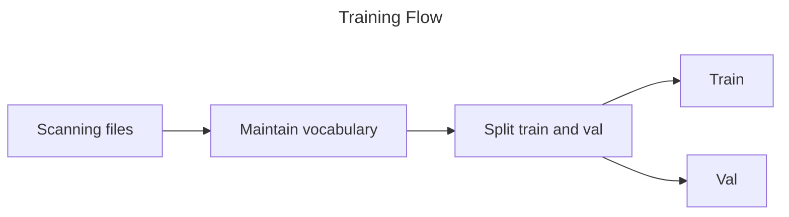
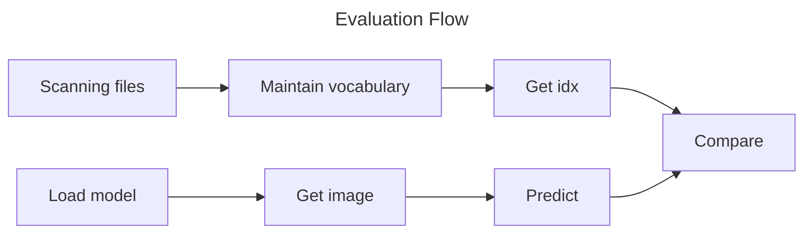
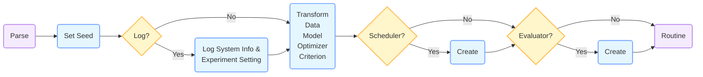
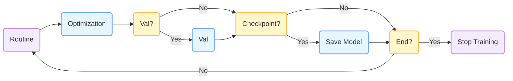
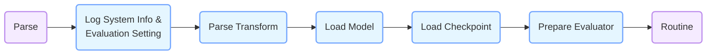
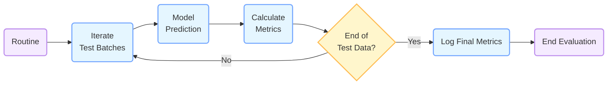

# <font face='times new romance'>Gelsight-Switch-Classification

## Get Ready for Gelsight-Switch-Classification

### ✅ Prerequisites

- Git
- Python
- Conda Environment
- CUDA (optional)

### ✨ Create Environment

```bash
conda create -n env_name python=3.9 -y
conda activate env_name
```

### 🛠️ Installation

```bash
# Following https://pytorch.org/get-started/locally/

# CUDA 11.8 version
conda install pytorch torchvision torchaudio pytorch-cuda=11.8 -c pytorch -c nvidia -y

# CUDA 12.4 version
conda install pytorch torchvision torchaudio pytorch-cuda=12.4 -c pytorch -c nvidia -y

# CPU version
conda install pytorch torchvision torchaudio cpuonly -c pytorch -y
```

```bash
 # Check installations and install dependencies
python check_installation.py
```

### ☁️ Data

Download the [Gelsight-Switch-Classification Data](https://pan.baidu.com/s/14WYzI-ecYVHNbmKwviBPOg?pwd=mhjd) and place them under the folder `dataset` and extract.

### 🚀 Quick Start
```bash
# Train
bash run.sh

# Evaluate
bash eval.sh
```

## How to Use Gelsight-Switch-Classification?

### 🤗 Introduction

Image classification (IC) is a very simple task. What you gonna do is to prepare the named images under the folder `dataset/rgbs`.



The optimization process is illustrated as followed:

<div align="center">
<table border="0">
<tr>
    <td></td>
    <td><h2>→</h2></td>
    <td></td>
</tr>
</table>
</div>

In our framework, you can use **string annotation files**. We will **ignore cases** but you should pay attention to spelling. *Numbers are obviously compatible.*

### 🔧 Work Flow
<div align="center">






</div>

### 📁 Project Structure
```bash
Gelsight-Switch-Classification/
├── README.md                   # Project description document
├── check_installation.py       # Script to check the installation environment
├── build_dataset.py            # Automatically create the dataset
├── train.py                    # Training script
├── eval.py                     # Evaluation script
├── run.sh                      # Training script
├── eval.sh                     # Evaluation script
├── assets/                     # Directory to store project-related asset files
├── dataset/                    # Dataset directory
│   ├── imgs/                   # Image directory
│   │   ├── train/              # Training set images
│   │   │   ├── *.png
│   │   ├── test/               # Test set images
│   │       ├── *.png
│   ├── anns/                   # Annotation directory
│   │   ├── train/              # Training set annotations
│   │   │   ├── *.txt
│   │   ├── test/               # Test set annotations
│   │       ├── *.txt
│   ├── rbgs/                   # Source dataset
│       ├── *.png
├── zoo/                        # Core code directory of the project
    ├── __init__.py             # Initialization file
    ├── models/                 # Model definition directory
    │   ├── __init__.py         # Initialization file
    │   ├── mobilenet_v3_s.py   # MobileNet V3 Small model definition
    │   ├── resnet18.py         # ResNet18 model definition
    │   ├── tools.py            # Model utility functions
    ├── transform_instances/
    │   ├── auto.yaml           # Data augmentation: Auto
    │   ├── complex.yaml        # Data augmentation: Complex
    │   ├── none.yaml           # No data augmentation
    │   ├── simple.yaml         # Data augmentation: Simple
    ├── criterions.py           # Loss function definition
    ├── data.py                 # Code related to data processing
    ├── engines.py              # Training and evaluation engines
    ├── evaluators.py           # Evaluator definition
    ├── logger.py               # Code related to logging
    ├── optims.py               # Optimizer and learning rate scheduler definition
    ├── regs.py                 # Registry-related code
    ├── transforms.py           # Code related to data transformation
```

### 📝 Data Format

#### File Naming

Image file names in this project follow a specific pattern, which can be represented in Python as:

```python
image: f"*_{class}.*"
```

This indicates that each image file name should end with an underscore followed by the class name and a random extension.

Here's an example of a valid image file name that adheres to the above format:

```bash
rgb_camera1_0000_DaXuanNiu.png
```

#### Dataset Splitting

##### Automatic Split

To create a random split of the dataset into training and test subsets, you can simply run the following command:

```bash
python build_dataset.py
```

This command will generate the split within the `dataset` folder.

##### Implementation Insights

- *Reproducibility*: A default seed value of `0` is used during the shuffling process. This ensures that the same random split can be reproduced whenever the command is run, facilitating consistent results across different runs.

- *Default Split Ratio*: By default, the dataset is split such that 80% (i.e., `0.8`) of the data is allocated to the training set, while the remaining 20% (i.e., `0.2`) is reserved for the test set.

##### Full Implementation

If you wish to customize the seed value for reproducibility or adjust the training set ratio according to your specific requirements, you can use the following command:
```bash
python build_dataset.py --seed {seed} --ratio {train_ratio}
```
Replace `{seed}` with the desired integer seed value and `{train_ratio}` with the proportion of data you want to allocate to the training set. The `train_ratio` should be a value between 0 and 1.

### ⚙️ Training

#### Workflow in `train.py`

The training process in `train.py` is neatly divided into two main phases. Presenting these as distinct flowcharts offers enhanced clarity and a better understanding of the overall process.

##### Training Workflow - Preparation



##### Training Workflow - Routine



#### How to Parse Arguments

For a comprehensive and in-depth guide on parsing command - line arguments in Python, refer to the official documentation: [docs-python-how-to-argparse-zh](https://docs.python.org/zh-cn/3/howto/argparse.html).

#### How to Use `train.py`

When running `train.py`, several essential arguments need to be provided to customize the training process effectively:

- `-d` / `--device`: Use this argument to specify the device on which tensors will be placed and operations will be executed. You can choose between `cpu` and `cuda`.

- `-b` / `--batch-size`: Set the size of each batch of data used during training. For more details, check [geeksforgeeks.org/ml-stochastic-gradient-descent-sgd/](https://www.geeksforgeeks.org/ml-stochastic-gradient-descent-sgd/).

- `-m` / `--model` / `--model-name`: Specify the model architecture you want to use. Currently, the supported models are `mobilenet_v3_s` [Searching for MobileNetV3](https://arxiv.org/abs/1905.02244), which is well-suited for CPU computations due to its lightweight nature, and `resnet18` [Deep Residual Learning for Image Recognition](https://arxiv.org/abs/1512.03385), a widely adopted practical baseline in numerous research papers.

- `-o` / `--optimizer` / `--optimizer-name`: Select the optimizer for training. The available options are `SGD` (stochastic gradient descent with momentum) and `AdamW` (Adam with momentum). Each optimizer has its own characteristics and is suitable for different types of problems.

- `--lr` / `--learning-rate`: Set the learning rate, which controls how much the model's parameters are updated during each training step. In practical applications, common values include `1e-2`, `1e-3`, `1e-4`, or `1e-5`. Choosing the right learning rate is crucial for the model's convergence and performance.

- `-c` / `--criterion` / `--criterion-name`: Select the loss function. The supported loss functions are `celoss` (Cross Entropy Loss) and `FocalLoss`, as described in the paper *Focal Loss for Dense Object Detection* ([https://arxiv.org/abs/1708.02002](https://arxiv.org/abs/1708.02002)).

In the Gelsight - Switch - Classification task, you can use `-e` / `--exp` / `--exp-name` to specify the experiment name. If this argument is not provided, the system will default to using the current system time as the experiment name.

To obtain detailed information about all available arguments and their usage, run the following command:
```bash
python train.py -h
```
Studying the `run.sh` script is an excellent way to understand how to set up and execute the training process. It provides a practical example of how to combine different arguments and configurations to start a successful training session.

### ✏️ Evaluation

#### Workflow in `test.py`
The evaluation process in `test.py` is structured into two main phases: preparation and the evaluation routine. Similar to the training workflow, presenting these as flowcharts helps in visualizing and understanding the process better.

##### Evaluation Workflow - Preparation

In the preparation phase, the script begins by parsing command - line arguments. These arguments are used to configure the evaluation process. After that, system information and evaluation settings are logged. Next, the data transformation for the test data is parsed, and the model is loaded. The corresponding checkpoint is then loaded to ensure the model is in the correct state for evaluation. Finally, an evaluator is prepared to calculate relevant metrics during the evaluation routine.

##### Evaluation Workflow - Routine

The evaluation routine starts by iterating through the test data batches. For each batch, the model makes predictions. Based on these predictions and the actual labels, relevant evaluation metrics are calculated. A check is then made to determine if all the test data has been processed. If not, the process continues with the next batch. Once all the data is processed, the final metrics are logged, and the evaluation process ends.

#### How to Use `test.py`
When running `test.py`, the following essential arguments need to be provided:
- `-d` / `--device`: Specify the device (either `cpu` or `cuda`) where tensors will be placed and operations will occur during the evaluation.
- `-m` / `--model` / `--model-name`: Indicate the model you want to evaluate. The supported models are `mobilenet_v3_s` and `resnet18`, as mentioned in the training section.
- `--ckpt` / `--checkpoint` / `--checkpoint-path`: Designate the checkpoint you intend to evaluate. When loading the checkpoint, `strict=True` is set to ensure the model structure is consistent. If there are any issues, it's advisable to review the training and evaluation settings.

In the Gelsight - Switch - Classification task, you can use `-e` / `--eval` / `--eval - name` to specify the evaluation name. If not provided, the system will default to using the current system time as the evaluation name.

To get a detailed breakdown of all available arguments, run the following command:
```bash
python test.py -h
```
The `eval.sh` script serves as a valuable example for understanding how to set up and carry out the evaluation process. It demonstrates how to use different arguments and configurations to perform a successful model evaluation. 